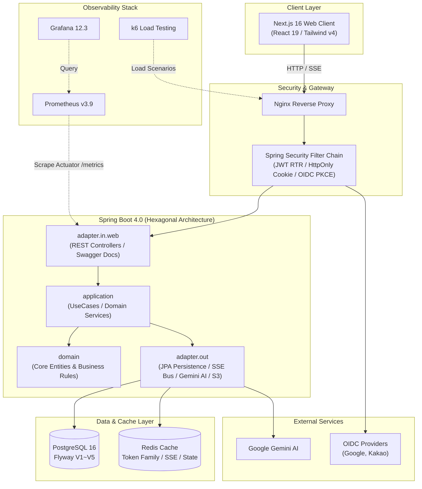
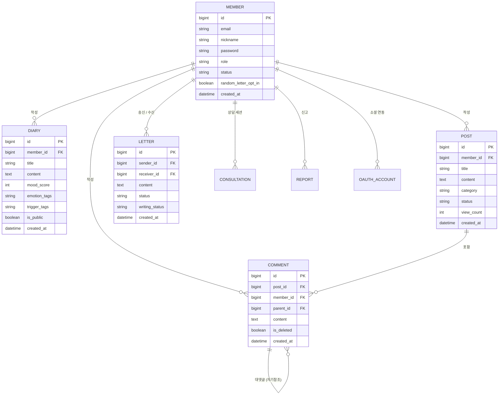

# 🌿 마음온 (Maum On)

> **"지친 일상 속, 당신의 마음에 따뜻한 온기를 전합니다."**  
> 마음온은 현대인의 감정 고립을 해소하고, 솔직한 감정 기록과 익명 편지 교환, 공감 커뮤니티, 그리고 24시간 실시간 AI 심리상담을 제공하는 **감정 교류 및 멘탈케어 힐링 플랫폼**입니다.

<p align="center">
  
  
  
  
  
  
  
  
  
  
</p>

---

## 📖 목차

1. [핵심 기능 (Core Features)](#-핵심-기능-core-features)
2. [시스템 아키텍처 (System Architecture)](#-시스템-아키텍처-system-architecture)
3. [기술 스택 (Tech Stack)](#-기술-스택-tech-stack)
4. [데이터베이스 모델 (ERD)](#-데이터베이스-모델-erd)
5. [디렉토리 구조 (Directory Structure)](#-디렉토리-구조-directory-structure)
6. [시작하기 (Getting Started)](#-시작하기-getting-started)
   - [사전 요구사항](#사전-요구사항)
   - [환경 변수 설정](#환경-변수-설정)
   - [백엔드 실행](#백엔드-실행)
   - [프론트엔드 실행](#프론트엔드-실행)
7. [관측성 및 부하 테스트 (Observability & Load Testing)](#-관측성-및-부하-테스트-observability--load-testing)
8. [문서 가이드 (Documentation)](#-문서-가이드-documentation)

---

## ✨ 핵심 기능 (Core Features)

### 1. 🗓️ 나만의 감정 기록 (감정 일기)
- **감정 점수 & 태그 큐레이션**: 하루의 감정을 1~5점 척도(`mood_score`), 감정 태그(`emotion_tags`), 상황/트리거 태그(`trigger_tags`)로 세분화하여 기록합니다.
- **캘린더 대시보드**: 월별 캘린더에서 날짜별 감정 흐름을 한눈에 파악할 수 있습니다.
- **사진 첨부 & 공개 설정**: 로컬/S3 스토리지 연동 이미지 첨부 및 나만의 비공개 보관 또는 커뮤니티 공개 피드 공유가 가능합니다.

### 2. 💌 비대면 온기 교류 (익명 랜덤 마음 편지)
- **익명 편지 발송 및 매칭**: 고민이나 따뜻한 응원을 담은 편지를 익명으로 발송하면 시스템 매칭을 통해 수신자에게 전달됩니다.
- **수락 / 거절 / 재전달**: 수신자가 편지를 읽고 수락하여 답장하거나, 거절 시 다른 사용자에게 자동으로 재전달됩니다.
- **실시간 작성 중 감지**: 발신함에서 상대방이 현재 답장을 작성 중인지(`writing`) 실시간으로 상태를 확인할 수 있습니다.

### 3. 💬 고민 나누기와 공감 (이야기 피드 & 댓글)
- **카테고리별 사연 공유**: 고민(`WORRY`), 일상(`DAILY`), 질문(`QUESTION`) 등 카테고리별로 자유롭게 이야기를 나누고 공감을 얻습니다.
- **해결 상태 관리**: 사연 작성자가 고민의 진행 상태를 `ONGOING`(진행 중)에서 `RESOLVED`(해결됨)로 변경할 수 있습니다.
- **계층형 대댓글**: 깊이 있는 위로와 소통을 위해 1단계 대댓글 구조를 지원합니다.

### 4. 🤖 24시간 즉각 심리지지 (AI 1:1 상담 & 위기 대응)
- **Google Gemini 기반 실시간 SSE 스트리밍 상담**: 시간에 구애받지 않고 언제든 마음을 털어놓을 수 있는 대화형 심리상담 챗봇을 제공합니다.
- **위기 상황 감지 및 핫라인 연계**: 자해/극단적 선택 등 위기 징후를 감지하면 즉시 자살예방 상담전화(109, 1393) 등 위기 핫라인으로 연결할 수 있는 모달 UI를 띄웁니다.

### 5. 🛡️ 클린 커뮤니티 보호 (AI 사전 검열 & 신고 제재)
- **Gemini 유해 콘텐츠 사전 검열 (`AuditAi`)**: 욕설, 비방, 유해 콘텐츠를 AI가 사전에 검열합니다.
- **다형적 신고 시스템**: 게시글, 댓글, 편지 등 커뮤니티 전반의 불건전 콘텐츠를 신고하고, 관리자가 검수 및 계정 제재(상태 변경, 세션 강제 만료)를 진행할 수 있습니다.

---

## 🏛️ 시스템 아키텍처 (System Architecture)



---

## 🛠️ 기술 스택 (Tech Stack)

| 구분 | 기술 / 라이브러리 | 버전 / 상세 |
| :--- | :--- | :--- |
| **Backend** | Java | 21 (OpenJDK Temurin) |
| | Spring Boot | 4.0.3 (Spring Security, Spring Data JPA, Actuator) |
| | Architecture | Hexagonal Architecture (Port & Adapter) |
| | Database | PostgreSQL 16, Flyway 마이그레이션 |
| | Cache / Session | Redis (RTR 블랙리스트, 편지 실시간 상태, 티켓) |
| | AI Integration | Google Gemini SDK (`com.google.genai:google-genai:1.0.0`) |
| | Authentication | JJWT 0.12.7, OIDC (Google, Kakao), HttpOnly Cookie, RTR |
| | API Docs | Springdoc OpenAPI (Swagger UI) 3.0.0 |
| | Code Style & Test | Spotless 8.3.0, Jacoco, Testcontainers 1.21.4, JUnit 5 |
| **Frontend** | Framework | Next.js 16.1.7 (App Router), React 19.2.3 |
| | Language | TypeScript 5 |
| | Styling | Tailwind CSS v4, PostCSS |
| | Animation & Icons | Framer Motion 12.38.0, Lucide React 1.0.1 |
| | State & Fetch | Custom Auth Store (`useAuthStore`), Fetch API |
| | Test & Quality | Vitest 4.1.1, ESLint 9 |
| **Infra & Ops** | Container | Docker Compose (개발 / 테스트 / 운영 분리) |
| | Web Server | Nginx Reverse Proxy |
| | Observability | Prometheus v3.9.1, Grafana 12.3.1 |
| | Load Test | Grafana k6 (Smoke / Load / Stress 시나리오 자동화) |
| | Cloud & CI/CD | AWS EC2, GitHub Actions (Blue-Green 무중단 배포) |

---

## 📊 데이터베이스 모델 (ERD)



---

## 📁 디렉토리 구조 (Directory Structure)

```text
maum_on/
├── back/                      # Spring Boot 백엔드 애플리케이션 (Java 21)
│   ├── src/main/java/com/back/
│   │   ├── auth/              # 인증/인가 (로그인, 회원가입, OIDC, 토큰 갱신)
│   │   ├── member/            # 회원 프로필, 설정, 관리자 회원 관리
│   │   ├── diary/             # 감정 일기 (점수, 태그, 캘린더 조회)
│   │   ├── letter/            # 익명 마음 편지 (송수신, 매칭, 답장)
│   │   ├── post/              # 사연 커뮤니티 게시글 (고민, 일상, 질문)
│   │   ├── comment/           # 게시글 댓글 및 대댓글
│   │   ├── consultation/      # 1:1 Gemini AI 심리상담 SSE 스트리밍
│   │   ├── notification/      # 실시간 알림 SSE 구독 및 이벤트 리스너
│   │   ├── report/            # 다형적 콘텐츠 신고 접수 및 관리자 검수
│   │   └── global/            # 시큐리티, 공통 예외, Redis, 설정
│   ├── src/main/resources/    # application-{dev, prod, test, k6}.yaml, Flyway 마이그레이션
│   └── docker-compose.dev.yml # 로컬 개발용 Postgres & Redis
├── front/                     # Next.js 프론트엔드 애플리케이션 (React 19)
│   ├── src/app/               # App Router 페이지 및 API 라우트
│   │   ├── (auth)/            # 로그인, 회원가입, OIDC 콜백
│   │   ├── dashboard/         # 월별 감정 일기 캘린더 대시보드
│   │   ├── diaries/           # 감정 일기 작성, 피드, 상세, 수정
│   │   ├── letters/           # 익명 마음 편지함 및 편지 작성
│   │   ├── stories/           # 사연 커뮤니티 및 댓글/대댓글
│   │   ├── settings/          # 프로필/계정 설정 및 회원 탈퇴
│   │   └── admin/             # 관리자 회원, 편지, 신고 검수 대시보드
│   ├── src/components/        # 전역 UI 컴포넌트, AI 상담 런처, 모달
│   └── src/lib/               # 인증 스토어, API 클라이언트, 유틸리티
├── docker-compose.yml         # 로컬 통합 테스트 스택 (Postgres + 모니터링)
├── docker-compose.monitoring.yml # 독립 모니터링 스택 (Prometheus + Grafana)
├── infra/                     # Nginx 설정, 모니터링 프로비저닝, Terraform
├── perf/k6/                   # k6 부하 테스트 도메인별 시나리오 및 자동화 러너
└── docs/                      # 아키텍처, API 계약, 런북 등 프로젝트 문서 체계
```

---

## 🚀 시작하기 (Getting Started)

### 사전 요구사항
- **Java**: OpenJDK 21 이상
- **Node.js**: 20.x 이상 (npm 10.x 이상)
- **Docker & Docker Compose**: 최신 Docker Desktop 또는 Docker Engine

### 환경 변수 설정
프로젝트 루트의 `.env.example`을 복사하여 `.env`를 생성하고 필요한 시크릿 값을 채웁니다:
```bash
cp .env.example .env
```

### 백엔드 실행
백엔드는 `spring-boot-docker-compose` 지원이 활성화되어 있어, Spring Boot 실행 시 로컬 개발용 PostgreSQL과 Redis가 자동으로 함께 기동됩니다.

```bash
# 1. (선택) 수동으로 DB 및 Redis 기동
docker compose -f back/docker-compose.dev.yml up -d

# 2. 백엔드 빌드 및 구동 (프로젝트 루트 기준)
./back/gradlew -p back bootRun

# 3. 백엔드 코드 포맷팅 자동 점검/적용
./back/gradlew -p back spotlessApply

# 4. 전체 단위/통합 테스트 실행
./back/gradlew -p back test
```
- **백엔드 서버 주소**: `http://localhost:8080`
- **Swagger API 문서**: `http://localhost:8080/swagger-ui/index.html`

### 프론트엔드 실행
```bash
# 1. 프론트엔드 디렉토리 이동 및 의존성 설치
cd front
npm install

# 2. 로컬 개발 서버 실행
npm run dev

# 3. 린트 및 단위 테스트 실행
npm run lint
npm run test

# 4. 프로덕션 빌드 검사
npm run build
```
- **웹 서비스 주소**: `http://localhost:3000`

---

## 📈 관측성 및 부하 테스트 (Observability & Load Testing)

마음온은 대규모 트래픽과 안정적인 시스템 운영을 위해 종합 모니터링 스택 및 k6 부하 테스트 시나리오를 기본 내장하고 있습니다.

### 1. 모니터링 스택 실행
```bash
docker compose -f docker-compose.monitoring.yml up -d
```
- **Prometheus**: `http://localhost:9090` (Spring Boot Actuator 메트릭 10초 주기 수집)
- **Grafana**: `http://localhost:3001` (기본 계정: `admin` / `.env` 설정 암호)
  - `maum-on-local-observability`: JVM 메모리, HikariCP 커넥션 풀, Tomcat 쓰레드, HTTP P95/P99 지연시간 모니터링
  - `maum-on-k6-load-test`: k6 부하 테스트 실시간 지표 대시보드

### 2. k6 부하 테스트 실행
```bash
# 개별 도메인 스모크 테스트 (smoke / load / stress 지원)
node perf/k6/run.mjs auth smoke
node perf/k6/run.mjs letters load
node perf/k6/run.mjs posts load

# 전체 도메인 순차 부하 테스트 자동 실행
bash perf/k6/run-auto.sh
```

---

## 📚 문서 가이드 (Documentation)

자세한 아키텍처 규격, API 계약 스키마, 배포 런북은 `docs/` 디렉터리에 체계적으로 정리되어 있습니다:

- [사람을 위한 문서 가이드](docs/README.md): 팀원 및 기여자를 위한 빠른 문서 인덱스
- [전체 문서 인덱스](docs/INDEX.yaml): 39개 기술 문서의 상태 및 분류 매트릭스
- [에이전트 라우팅 가이드](docs/AGENT-CONTEXT.md): 작업 도메인별 책임 범위와 불변식
- [인증 API 계약 명세](docs/AUTH_API_CONTRACT.yaml): 세션, RTR, OIDC 상세 규약
- [관측성 및 k6 런북](docs/LOCAL_OBSERVABILITY_K6_RUNBOOK.yaml): 로컬 메트릭 및 부하 검증 가이드
- [배포 환경 매트릭스](docs/DEPLOY_ENV_MATRIX.yaml): AWS 및 프로덕션 환경변수 매핑 규약

---

## 📄 라이선스 (License)

본 프로젝트는 팀 프로젝트 결과물로서 비상업적 학습 및 포트폴리오 목적으로 관리됩니다.
